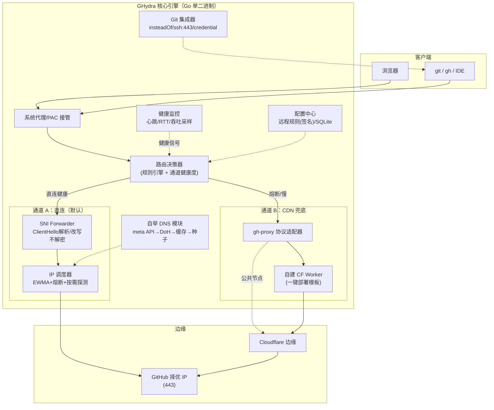
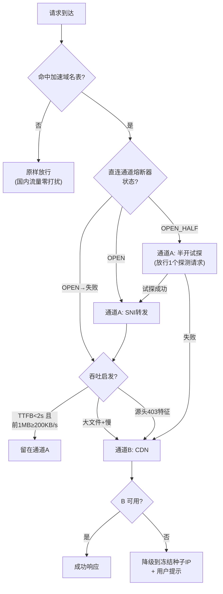
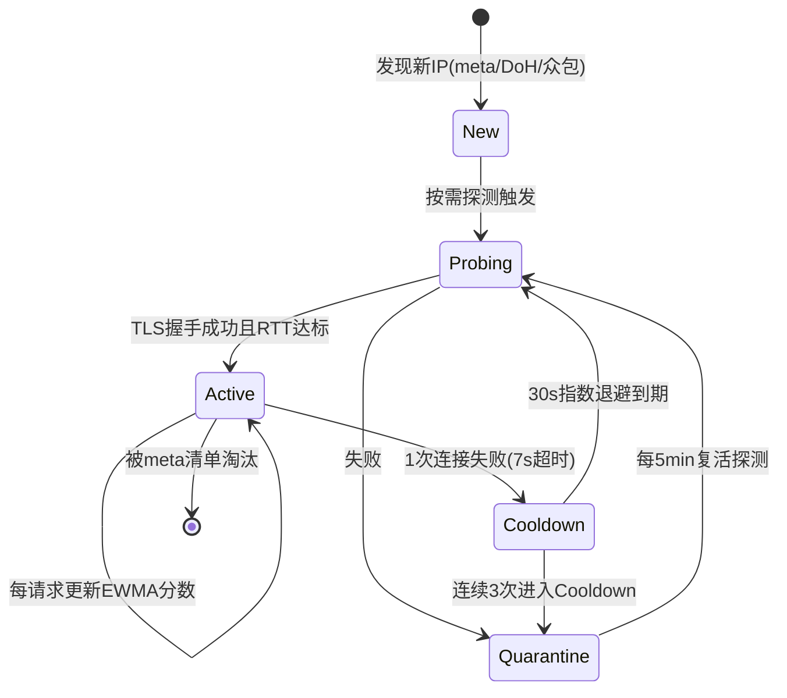

# GHydra（九头鸟）— GitHub 全链路加速器
## 产品需求文档（PRD）+ 技术路线图

| 项 | 内容 |
|---|---|
| 版本 | v1.0 (Draft) |
| 日期 | 2026-09-12 |
| 角色 | 产品负责人 / 首席架构师 |
| 状态 | 立项评审中 |

---

## 0. 一句话定位

> **一头直连，一头 CDN —— 断一头，活一头。**
> 让中国开发者的 GitHub 在「网页 / 登录 / clone / push / Release 下载 / SSH」六个场景下，可用率不低于 99.5%。

---

## 1. 问题定义

### 1.1 现状分层诊断（技术光谱 L0–L5）

| 层级 | 方案 | 修复 | 代表 | 致命缺陷 |
|---|---|---|---|---|
| L0 | hosts 择优 | DNS | Ghips | 域名清单写死；无自举；不修吞吐 |
| L2 | 本地 DNS + IP 测速 | DNS | FastGithub（原仓库已 404） | 不修吞吐；需装 CA 证书 |
| L3 | 系统代理 + MITM + SNI 改写 | 流量层 | dev-sidecar（24k★，活跃） | Electron 150MB；MITM 安全代价；直连派对源头封锁无解 |
| L4 | CDN 反代 | 出口层 | gh-proxy.com | 无 UI；不修网页登录；依赖第三方节点 |

### 1.2 六大场景 × 现有方案覆盖矩阵（痛点来源）

| 场景 | 依赖域名/协议 | Ghips | dev-sidecar | gh-proxy |
|---|---|---|---|---|
| 打开网页 | github.com | ✅ | ✅ | ✅ |
| 页面样式/头像 | github.githubassets.com / avatars.* | ❌ | ✅ | ⚠️ |
| IDE/OAuth 登录 | api.github.com | ❌ | ✅ | ❌ |
| clone/push (HTTPS) | github.com | ✅ | ✅ | ✅ |
| git over SSH (:22) | git@github.com:22 | ⚠️ | ⚠️ | ❌ |
| Release 大文件 | objects.github*.com | ❌ 慢/失败 | ⚠️ 慢 | ✅ 主战场 |
| 源头封锁（2025-04 型） | — | ❌ | ❌ | ✅ |

**核心洞察：没有任何一个现有方案同时覆盖全部六行。产品机会 = L3 直连调度 + L4 CDN 兜底的「双通道」融合，这是开源界尚未做烂的组合。**

### 1.3 战略依据：2025-04-12 事件

GitHub 对大陆 IP 整体 403（04-12 20:01 UTC → 04-13 14:55 回滚）。直连派（L0–L3）当时全灭，仅 CDN 反代（L4）存活。**结论：单一通道架构在结构上不完备，双通道 + 自动降级是刚需而非锦上添花。**

---

## 2. 产品定位

### 2.1 北极星指标

**周活跃用户的「GitHub 六场景可用率」≥ 99.5%**
（定义：一周内 6 个场景探测全成功的用户占比）

### 2.2 辅助指标

| 指标 | 目标 | 对标 |
|---|---|---|
| Release 下载中位速度 | ≥ 2 MB/s | 现状 30–300 KB/s |
| 通道故障恢复时间 MTTR | < 30 秒（自动降级） | 现状：手动重启工具 |
| 直连命中率 | ≥ 85%（省 CDN 流量成本） | — |
| 安装包体积 | 无红线（2026-09-13 取消；记录实测供参考，CLI 当前 10–11MB） | dev-sidecar 147 MB |
| 常驻内存 | ≤ 120 MB | dev-sidecar 裁剪后仍 200MB+ |
| 冷启动到可用 | ≤ 3 秒 | — |

### 2.3 设计原则（乔布斯式砍法）

1. **默认不解密**：核心模式是 SNI 转发（不碰 TLS 内容，无需 CA 证书）。MITM 曾列为可选增强，2026-09-13 拍板移出 v1.0（v2.0+ 候选）——v1.0 是纯不解密产品。→ 砍掉 FastGithub/dev-sidecar 最大的安全心魔。
2. **一个开关**：用户界面只有「加速：开/关」和一个体检按钮。所有智能调度在后台。→ 反例：dev-sidecar 的设置树。
3. **断头重生**：任何单点（某个 IP、某条通道、某个 CDN 节点）挂掉，用户无感。这是产品名字「九头鸟」的含义。
4. **自己的更新自己扛**：升级流量走自己的双通道，杜绝「加速器自己更新失败」的鸡生蛋。
5. **隐私默认零遥测**：一切数据本地，遥测 opt-in 且匿名。

### 2.4 差异化矩阵

| 能力 | Ghips | FastGithub | dev-sidecar | gh-proxy | **GHydra** |
|---|---|---|---|---|---|
| 无证书直连 | ❌ | ❌ | ❌ | — | ✅ |
| 运行时 IP 调度（熔断/按需探测） | ❌ | 部分 | ✅ | — | ✅ |
| CDN 通道自动降级 | ❌ | ❌ | ❌ | 手动 | ✅ |
| 源头封锁存活 | ❌ | ❌ | ❌ | ✅ | ✅ |
| Git/SSH 深度集成 | ❌ | 部分 | 部分 | ❌ | ✅ |
| 单二进制分发 | ✅ | ✅ | ❌ | — | ✅ |
| 六场景一键体检 | ❌ | ❌ | ❌ | ❌ | ✅ |

---

## 3. 用户画像

| 画像 | 描述 | 核心诉求 | 付费意愿 |
|---|---|---|---|
| P1 在校学生 | 宿舍网，无代理预算 | clone 能成功、Release 能下 | 低（开源免费版） |
| P2 一线业务开发 | 白天办公网，禁 VPN | push 不中断、IDE 能登录 | 中 |
| P3 开源维护者 | 大仓库、频繁 Release | 大文件吞吐、CI 依赖稳定 | 中高 |
| P4 团队技术负责人 | 团队 20+ 人 | 统一部署、远程规则下发 | 高（企业版潜在） |

---

## 4. 功能需求

优先级：P0 = v1.0 必须；P1 = v1.5；P2 = v2.0。

### F1 六场景一键体检（P0）
- 一键探测：网页 / 登录态 / IDE授权 / clone / push(1KB dry-run) / Release TTFB+速率 / SSH:22+443
- 输出「病历 + 处方」：每项失败原因（DNS 污染 / TCP 阻断 / TLS 重置 / 源头403 / 限速）+ 对应处方
- 验收：任意单项故障注入后，体检报告能给出正确根因分类（准确率 ≥ 90%）

### F2 双通道智能路由（P0，核心壁垒）
- 通道 A（直连）：SNI 转发 + 择优 IP
- 通道 B（CDN）：gh-proxy 协议适配 + 一键部署的自建 Cloudflare Worker 模板
- 决策器：熔断（连续 1 次失败即切换候选）+ 吞吐启发（TTFB > 2s 或前 1MB < 200KB/s 且目标 > 10MB → 走 CDN）
- 降级方向可配：A→B（默认）；也可 B→A（纯 CDN 用户）
- 验收：模拟源头 403（hosts 指向黑洞服务器）后 30 秒内新请求自动走通道 B，进行中连接 P1 支持断点续传

### F3 无证书直连引擎（P0）
- 本地透明代理（系统代理 + PAC，非 hosts 模式）
- TLS ClientHello 解析（手写 ~150 行，不引第三方库，便于审计）
- 提取真实 SNI → 连接择优 IP，原样转发（**透明 SNI 改写已于 M0 实验证伪并移出功能集**：TLS 1.3 在 ServerHello 密钥派生即绑定握手全文 transcript，TLS 1.2 在 Finished 校验绑定——中间盒改写 ClientHello 任一字节必然 bad record mac。`ghydra poc --rewrite-sni` 仅保留为协议实验工具）
- IP 池来源：GitHub meta API（`/meta` 的 web/git 字段 + `domains.website`）→ DoH 校验（dns.alidns.com JSON API）→ last-good 本地缓存 → 冻结种子清单（四级自举链）
- 验收：Wireshark 抓包证明用户流量未被解密；ClientHello 解析单次 < 50µs

### F4 增强模式（可选 MITM，~~P1~~ → **P3，v2.0+ 候选**——2026-09-13 二次拍板移出 v1.0，见 M3-Plan D6）
- 自签 CA + 动态证书签发（每台主机唯一）
- HTTP/2 多路复用、googleapis CDN 资源替换、CSP nonce 注入
- 开启时强提示安全风险；证书一键卸载
- 验收：关闭增强模式后系统证书存储无残留
- **移出理由**：工作量（三平台信任库+签发+h2+改写+合规面）与收益（仅浏览器 B 兜底单一场景，已有 `ghydra get` 替代）严重失衡；与核心链路零耦合。v1.0 已留 API 桩与前端占位页，恢复零返工

### F5 Git / SSH 深度集成（P0/P1）
- P0：自动写入 `url.insteadOf`（大文件 Release/仓库 → CDN 前缀；小操作 → 直连）
- P0：检测 22 端口 SSH 连通性，自动写入 `~/.ssh/config`（`ssh.github.com:443`）
- P1：git credential 助手配好（PAT 引导，2021 后无密码认证）
- P1：`git lfs` / 大仓库克隆向导
- 验收：全新机器上 `git clone` + `git push` + Release 下载三件事零手工配置完成

### F6 自举与更新（P0）
- 规则热更新：远程规则 JSON（ed25519 签名）→ 校验 → 原子替换；断网时用冻结清单
- 程序自更新：下载流量强制走自身通道 A/B；更新失败不破坏旧版本（双目录切换）
- 验收：拔网线状态下工具可启动并以缓存规则工作

### F7 众包 IP 情报（P2，opt-in）
- 匿名上报：IP × 城市 × 运营商 × 时段 × RTT/成功率（哈希化，无任何用户标识）
- 服务端聚合生成「IP 质量热力图」，回灌默认规则
- 数据飞轮：用户越多 → IP 情报越准 → 体验越好 → 用户越多

### F8 隐私与安全（P0）
- 默认零遥测；日志本地化；一键导出诊断包（脱敏）
- 不解密是 v1.0 唯一模式（MITM 已移出 v2.0+，见 F4）
- 规则签名防投毒；更新包签名 + 哈希双校验

---

## 5. 非功能需求

| 维度 | 要求 |
|---|---|
| 性能 | 代理层单连接额外延迟 ≤ 5ms；单核转发 ≥ 1Gbps；1000 并发连接 |
| 资源 | 常驻内存 ≤ 120MB；CPU 空闲 ≤ 1%（体积不设红线，2026-09-13 拍板） |
| 平台 | Windows 10+（P0）、macOS arm64/x64（P0）、Linux x64（P1） |
| 可靠性 | 进程崩溃自动重启（服务化）；端口被占自动迁移并更新 PAC |
| 合规 | 不加密流量、不建隧道、走公用国际出入口信道；无「翻墙」功能；开源协议 MIT ¹ |
> ¹ **可见性状态（2026-09-13）**：仓库已转 private（开发期决策）。代码许可仍为 MIT 文件未改，
> 但"是否对外开源发布"是 v1.0 的前置拍板项——发布前需确认后再据此修订本行与 M3 交付物表述。


---

## 6. 系统架构

### 6.1 总体架构图



### 6.2 请求决策主流程



### 6.3 IP 调度器状态机



调度分数：`score = 0.3·RTT_ewma + 0.5·失败率_ewma + 0.2·抖动`，选 score 最低者；同一目标域名粘性 60s（避免连接重建风暴）。

### 6.4 自举链（鸡生蛋的终极解法）

```
启动
 ├─ ① GitHub meta API（https://api.github.com/meta）
 │     └─ 拿到: web/git 的 /32 IP + domains.website 域名清单
 ├─ ② 失败? → DoH: https://dns.alidns.com/resolve?name=github.com&type=A
 │     └─ 拿到: 未污染的 A 记录
 ├─ ③ 还失败? → 本地 SQLite 的 last-good 缓存（上次成功结果+时间戳）
 ├─ ④ 还失败? → 二进制内冻结种子清单（发版时快照,只作兜底）
 └─ ⑤ 种子IP直连 meta API（Host头指定,绕开DNS）→ 回到 ①
```

### 6.5 关键数据结构（示意）

```go
type IPPool struct {
    IPs       map[string]*IPEntry   // key: ip
    ByDomain  map[string]*Ring      // 每域名粘性环
}
type IPEntry struct {
    IP        string
    State     State          // New/Probing/Active/Cooldown/Quarantine
    RTT       float64        // EWMA, ms
    FailRate  float64        // EWMA
    Jitter    float64
    LastSeen  time.Time
    Source    string         // meta/doh/crowd/seed
}
type Rule struct {
    Domains   []string       // *.github.com, *.githubusercontent.com ...
    Channel   string         // A / B / auto
    SNI       string         // 可选改写目标
    MinKBps   int            // 吞吐阈值
    Sig       string         // ed25519 签名
    Version   int
}
```

---

## 7. 技术选型与理由

| 层 | 选型 | 理由（含被否决项） |
|---|---|---|
| 核心语言 | **Go 1.22+** | 单二进制、goroutine 天然适配连接代理、交叉编译。否决 Rust（迭代速度）、Electron（体积） |
| GUI | **Wails + SolidJS**（v2.13+ 保底；M3 时若 v3 已发 3.0 正式版则切 v3，决策规则见 DevWorkflow §6） | 纯 Go 单一技术栈，CI 免装 Rust；本地 HTTP API 驱动，GUI 与引擎解耦（可 headless 服务器部署）。否决 Electron（147MB 反例）；否决 Tauri（Go+Rust+Node 三套工具链，且其 updater 插件优势被 F6 自研更新抵消） |
| DNS | miekg/dns + 自实现 DoH JSON 客户端 | UDP/TCP/53 本地服务 + DoH 自举 |
| TLS 解析 | 手写 ClientHello 解析（~150行） | 可审计、零依赖；不引 utls（合规敏感） |
| 代理内核 | net/http + goroutine 池 + bradfitz/gopacket? 否——纯标准库 TCP splice | 零拷贝 io.Copy；P1 评估 splice 系统调用 |
| 存储 | modernc.org/sqlite（pure Go） | 无 CGO，交叉编译友好 |
| CDN 通道 | Cloudflare Workers + TypeScript + wrangler | 一键 Deploy 按钮；免费额度 10 万请求/天；出口即海外 |
| 规则签名 | ed25519（minisign 兼容） | 防规则投毒 |
| CI/CD | GitHub Actions（自举：产物上传后用自身通道分发） | — |
| 遥测（P2） | 自建聚合端点 + ClickHouse | 匿名哈希，无用户标识 |

---

## 8. 里程碑计划（20 周）

### M0 · 第 1–2 周 · 「验证一条命」
- **目标**：技术风险清零——SNI 转发可行、自举链打通
- **做什么**
  - 手写 ClientHello 解析 + SNI 改写 PoC（Go, ~300 行）
  - DoH（alidns JSON）+ meta API + 种子 IP 直连拉取——四级自举链原型
  - CF Worker 免费档大文件代理实测：CPU 时间限额 + 100–500MB 级 Release 流式透传行为（决定通道 B 设计容量）
  - 基准：单连接延迟开销、千并发稳定性
- **技术**：Go 标准库、crypto/tls、miekg/dns
- **退出标准**：① 改写 SNI 后 TLS 握手成功且 GitHub 可访问 ② 自举链在断 DNS（改 127.0.0.1:53）环境下仍能拿到 IP ③ 通道 B 容量可行性结论：基于公开数据 + 生产案例佐证（gh-proxy.com 7T/天、cf-ghproxy-worker 开源模板）——免费档限额的**针对性实测推迟至 M2 开局**（带产品需求测：100–500MB Release 流式透传 + CPU 限额行为），作为 M2 通道 B 设计输入
- **交付物**：PoC 仓库 + 基准报告

**M0 实验记录（2026-09-12，真机直连环境实测）**
- ① SNI 透传：六域名 6/6 存活（github / api / codeload / avatars / objects / raw 全部完成 TLS 握手 + 真实 HTTP 响应，证书链完整）
- ② 断 DNS 自举：系统 DNS 置黑洞后，L2 DoH 经服务 IP 直连（223.5.5.5）227ms 兜底成功；DoH 亦失效时 L3 缓存 0.4ms 兜底——每级均不依赖系统 DNS
- 性能：ClientHello 解析 1.87µs/op（验收线 <50µs，26 倍余量），改写 86ns
- 反向结论：SNI 透明改写在 TLS 1.2 / 1.3 下均被 transcript 完整性机制协议级阻断（bad record mac），双版本对照实验完成，移出功能集
- 千并发：3000 连接（1000 瞬时风暴 × 3 轮）成功率 100%、goroutine 零泄漏、HeapSys 28MB（红线 120MB）；风暴态 p99 尾延迟 15.5s 由 accept backlog × SYN 重传退避主导——阶梯对照（同规模 1000 连接分批）p99 仅 1.15s / 吞吐 650 conn/s，真实用户即阶梯模式。M1 正式引擎待办：ListenConfig backlog 调优 + 连接复用池
- 剩余：无——③ 已改为公开数据 + 生产案例佐证（gh-proxy.com 7T/天），CF 免费档针对性实测挪至 M2 开局

### M1 · 第 3–6 周 · 「直连通道产品化」
- **目标**：通道 A 达到可日常自用（dogfooding）
- **做什么**
  - IP 调度器（EWMA + 状态机 + 按需探测 + 7s 熔断）
  - 系统代理/PAC 接管（Windows 注册表 / macOS networksetup）
  - 域名规则引擎 + 本地 SQLite 缓存
  - CLI（`ghydra doctor / on / off / status`）
- **技术**：Go、gopsutil、sysproxy 思路
- **退出标准**：作者本人 7 天全部 GitHub 流量走它，六场景可用率 ≥ 97%
- **交付物**：v0.1 CLI

### M2 · 第 7–10 周 · 「双通道与降级」
- **目标**：2025-04 型事件抗压；大文件吞吐达标
- **做什么**
  - CF Worker 反代模板（一键 Deploy + 自适应缓存）
  - gh-proxy 协议适配器 + 通道决策器（熔断 + 吞吐启发）
  - Git 集成：insteadOf 自动化、ssh.github.com:443 检测写入
  - 故障演练脚本（注入 403 / RST / DNS 污染）
- **技术**：TypeScript/Workers、wrangler、git config 自动化
- **退出标准**：注入源头 403 后 30s 内自动降级；Release 中位速度 ≥ 2MB/s
- **交付物**：v0.5 beta + 50 人内测

### M3 · 第 11–14 周 · 「产品化与安全」
- **目标**：小白可用的 v1.0
- **做什么**
  - Wails GUI（一个开关 + 体检报告页）——开局 spike 一周，按 DevWorkflow §6 决策规则定 v2/v3 并验证托盘/自启/单实例
  - ed25519 签名的远程规则热更新；自更新走自身通道
  - 安全加固：规则防投毒（ed25519 签名 + 版本单调）、诊断包脱敏（MITM 可选模式已移出 v1.0，v2.0+ 候选）
  - winget / Homebrew / scoop 分发
- **技术**：Wails（v2/v3 按 spike 决策规则）、SolidJS、minisign
- **退出标准**：全新 Windows 机器，双击安装→一键加速→clone+push+Release 三件事零配置完成
- **交付物**：v1.0 公测（开源 ¹；¹ 见 §合规 脚注——可见性与许可策略属待拍板项）

### M4 · 第 15–20 周 · 「数据飞轮与生态」
- **目标**：护城河
- **做什么**
  - 众包 IP 情报（opt-in 匿名遥测 → IP 质量热力图 → 回灌默认规则）
  - 企业版雏形：团队规则下发、集中观测面板
  - 插件系统（加速任意站点：HuggingFace / npm / Docker Hub）
- **技术**：ClickHouse、简单时序预测（EWMA→分位数回归）
- **退出标准**：众包数据使冷启动用户的直连命中率提升 ≥ 10 个百分点
- **交付物**：v2.0

---

## 9. 风险登记册

| 风险 | 概率 | 影响 | 对策 |
|---|---|---|---|
| ~~SNI 改写被针对性识别~~ | — | — | 已于 M0 实验证伪并移出功能集（TLS transcript 完整性阻断一切透明改写，与识别无关）；通道 A 主力 = IP 择优 + 原样 SNI 转发 |
| 公共 gh-proxy 节点跑路/投毒 | 高 | 中 | 默认引导自建 CF Worker（一键部署）；协议适配层可插拔 |
| GitHub meta 接口改版 | 中 | 中 | `domains` 字段 + DoH + 缓存三重冗余；版本化解析器 |
| MITM 模式被滥用/误用 | 低 | 高 | **已随 2026-09-13 拍板移出 v1.0**（v2.0+ 候选，届时默认关+二次确认+一键卸载） |
| 浏览器 B 兜底缺口（移出 MITM 的已知代价） | 中 | 中 | GUI 空态 + README 引导 `ghydra get`（完整 A/B 切换）；恢复触发器见 M3-Plan D6 |
| 合规风险 | 中 | 高 | 不解密不建隧道；合法性声明随包分发；必要时仅保留 CDN 通道模式 |
| Electron 化膨胀（重蹈 dev-sidecar） | 中 | 中 | 架构宪章：GUI 只调本地 API，引擎必须可 headless |

---

## 10. 度量体系

- **北极星**：六场景周可用率 ≥ 99.5%
- 漏斗：安装 → 首次加速成功（目标 ≤ 60s）→ 7 日留存（≥ 60%）
- 技术健康度：直连命中率、降级触发次数/周、MTTR、崩溃率
- 生态：自建 Worker 部署数、众包上报城市数

---

## 11. 合规声明（随软件分发）

本工具不解密、不加密、不建立额外信道；直连模式仅做 IP 择优与协议字段透传，全部流量经公用电信网国际出入口信道；CDN 模式为普通 HTTPS 反向代理。无任何「翻墙」功能与计划。

---

## 附录 · 术语表

| 术语 | 含义 |
|---|---|
| SNI | TLS ClientHello 中的服务器名指示，明文可见 |
| Domain Fronting | 改写 SNI 为无害域名以绕过基于 SNI 的识别 |
| EWMA | 指数加权移动平均，用于 RTT/失败率平滑 |
| 熔断器 | Circuit Breaker，连续失败后快速切换通道的模式 |
| MTTR | Mean Time To Recovery，故障恢复平均时长 |
| 自举 | 工具获取自身运行所需外部信息的降级链设计 |
